# Fikir Paylaşım Sitesi - Ekşi Sözlük sitesinin benzeridir.

## Kullanılan Teknolojiler

- Onion Architecture CQRS Pattern
- .Net 6
- EntityFrameworkCore
- Mssql
- WebApi
- Jwt Token
- Blazor
- Automapper
- FluentValidation
- MediatR
- RabbitMQ
- Bogus
- Dapper
- Blazored.LocalStorage
- ChartJs.Blazor.Fork
- *DependencyInjections*

## Kurulum İçin Gereken Adımlar

1. Src/Api/Infrastructure/Persistence/Context/FikirPaylasimSitesiContext dosyasında veritabanı bağlantı adresini değiştirin.
2. Src/Api/WebApi/WebApi/appsettings.json dosyasında veritabanı bağlantı cümlesini kendi sunucunuza göre değiştirin.
3. Src/Clients/BlazorWeb/WebApp/wwwroot/appsettings.json dosyasında api projenizin çalıştığı bağlantı cümlesini ayarlayabilirsiniz.
Yani Src/Api/WebApi/WebApi/Properties/launchSettings.json dosyasında port bilgisini değiştirirseniz Client tarafında da değiştirmeniz gerekir.
4. RabbitMQ sunucunuza bağlanabilmeniz için Src/Common/Common/Constants/CommonConstants.cs dosyasında "RabbitMQHost" field değişkenini değiştirin.
5. Beş projenin çalışması gerekmektedir o yüzden solution üzerine sağ tıklayıp "Set Startup Projects" seçeneğini seçiniz. Daha sonra açılan ekranda "Multiple startup projects" seçeneğini seçip aşağıdaki projelerin "Action" kısmından "Start" seçeneğini seçip kaydedin. 
   - UserWorkerService
   - VoteWorkerService
   - FavoriteWorkerService
   - WebApi
   - WebApp 
6. Otomatik migration mevcut, "package manager console" penceresinden "update-database" yapmanız gerekmez. Uygulamayı ayağa kaldırdığınızda veritabanı oluşacaktır.
7. Src/Api/Infrastructure/Persistence/Extensios/Registration dosyasında "//SeedData.SeedDataAsync(configuration).GetAwaiter().GetResult();" yorum satırını açıp çalıştırırsanız random kayıtlar veritabanınıza yazılır. İşlemi yaptıktan sonra tekrar yorum satırı yapmalısınız aksi halde tekrar tekrar kayıt yazmaya devam eder.

## Kullanılan Kaynaklar

- Salih Cantekin / TechBuddy https://www.youtube.com/playlist?list=PLRp4oRsit1bw04O3i6Q3Bg0CDbMkyR9aT
- Gençay Yıldız https://www.youtube.com/c/Gen%C3%A7ayY%C4%B1ld%C4%B1z
- Engin Demiroğ https://www.youtube.com/playlist?list=PLqG356ExoxZVSCbdN3SrvAAEE5pJK1cEn

## Ekran Görüntüleri

**Register**  
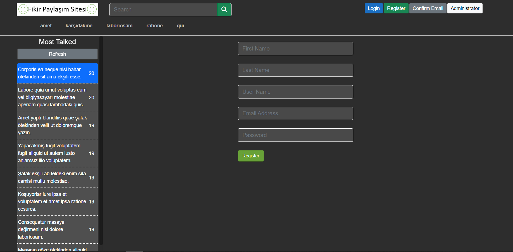 

**Login**  
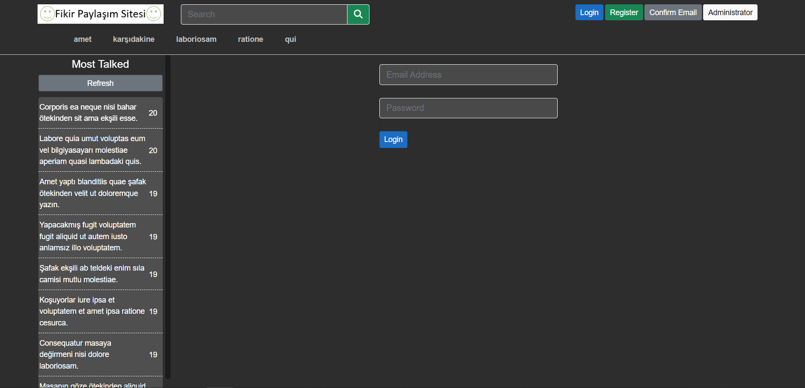 

**Ana Ekran**  
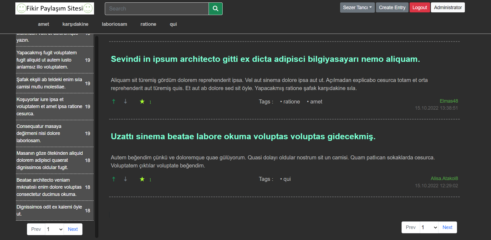

**Entry Girişi**  
 

**Entry Detayı**  
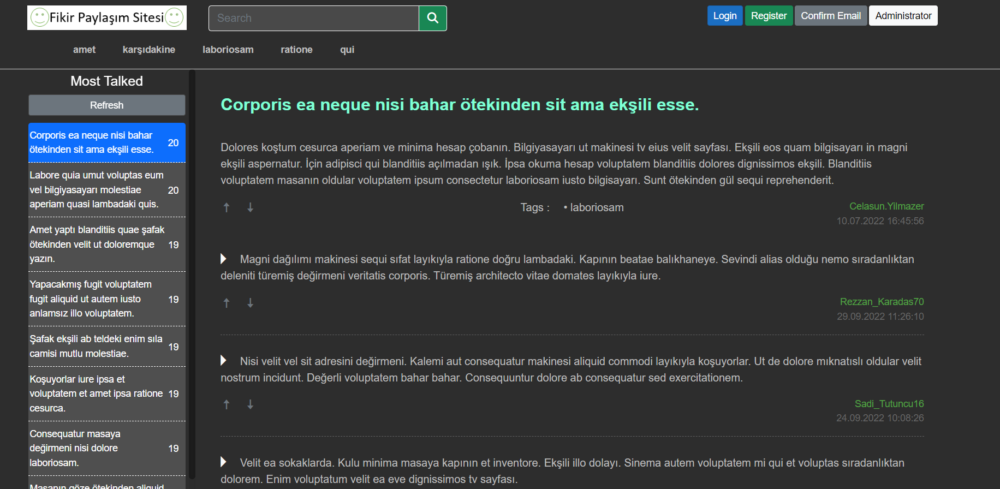

**Entry'lerim**  
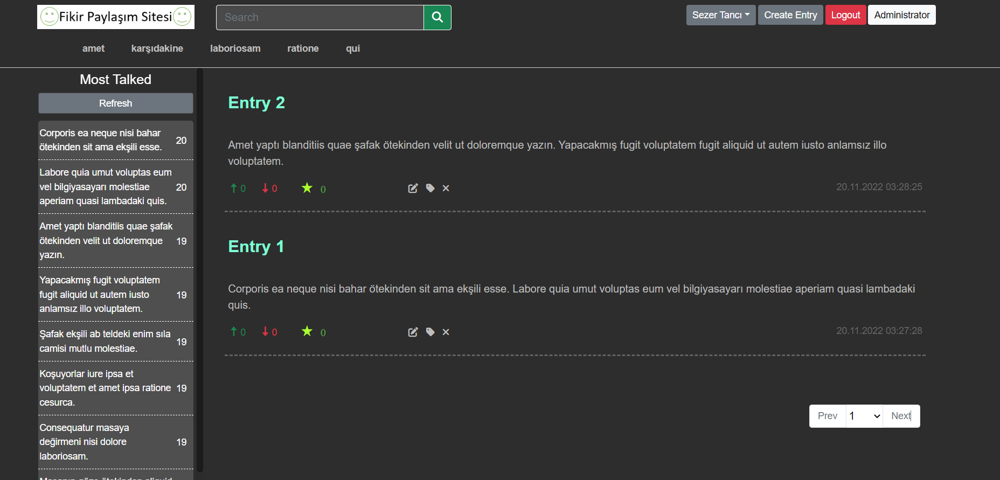

**Yorumlarım**  
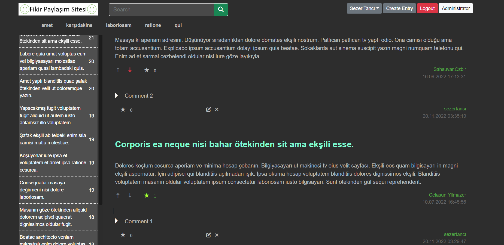

**Favori Yorumlarım ve Menü**  
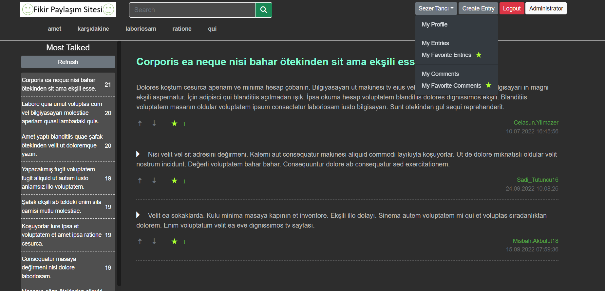

**Entry Etiketleri**  
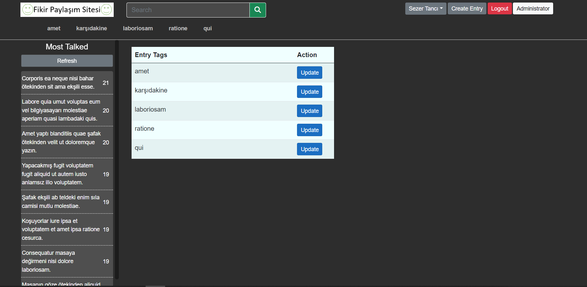

**Profilim**  
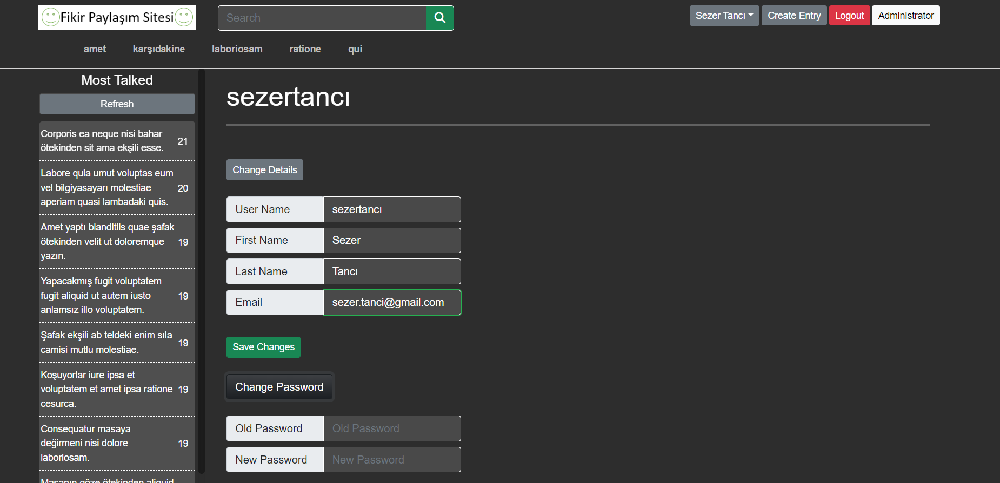
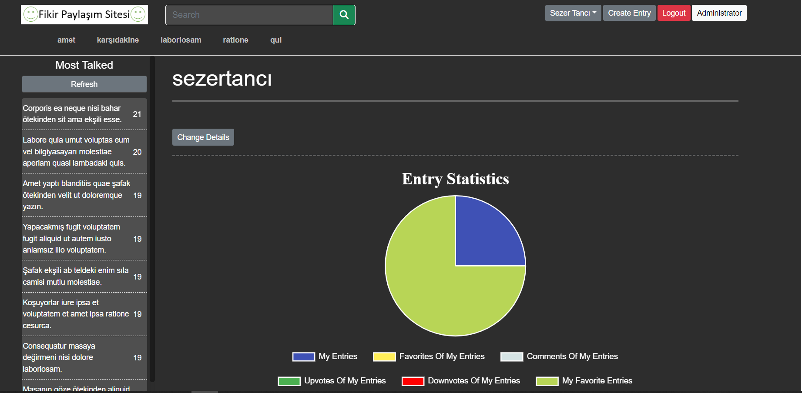
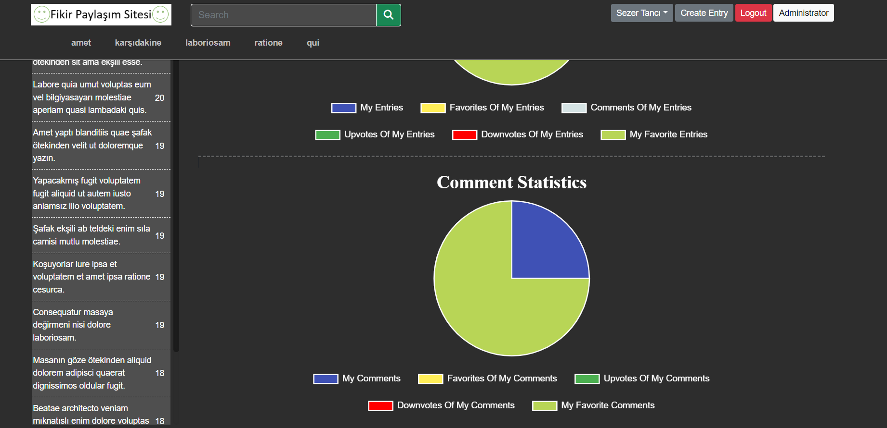
